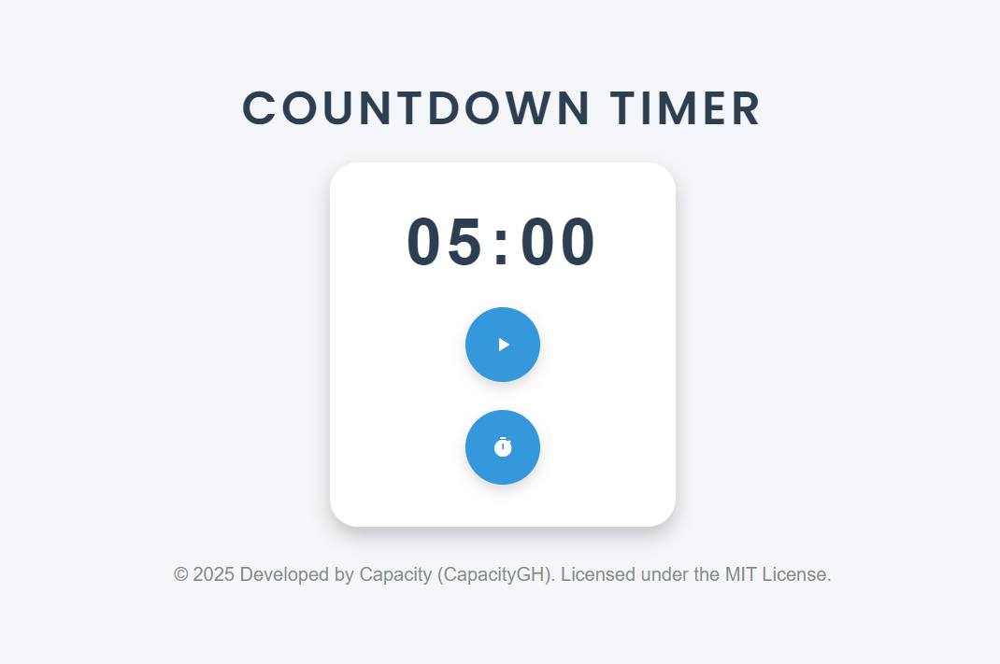

# Countdown Timer

This is a simple countdown timer application built with HTML, CSS, and JavaScript.

## Features
- **Countdown Timer**: Set a countdown in minutes (0–59) and track the remaining time.
- **Start/Pause**: Toggle between starting and pausing the timer.
- **Reset**: Reset the timer to a new value entered by the user.

## Installation
1. Clone the repository:
	```
	git clone https://github.com/CapacityGH/countdown-timer.git
	```
3. Navigate to the project directory:
   ```
   cd countdown-timer
   ```
4. Open the `index.html` file in your browser to run the timer.

## Usage
1. Open the timer in your browser.
2. Use the reset button to set the desired countdown time (in minutes).
3. Click the start button to begin the countdown.
4. Pause the timer at any moment using the pause button.
5. Reset the timer to a new value whenever needed.

## Screenshots


## Contributions
Feel free to fork the repository and submit pull requests for improvements.

---
Happy coding! (～￣▽￣)～
